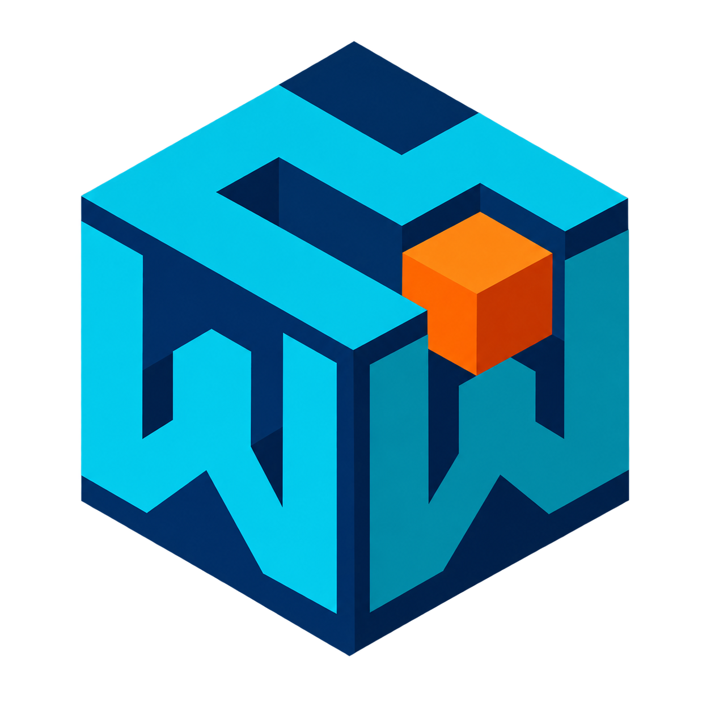
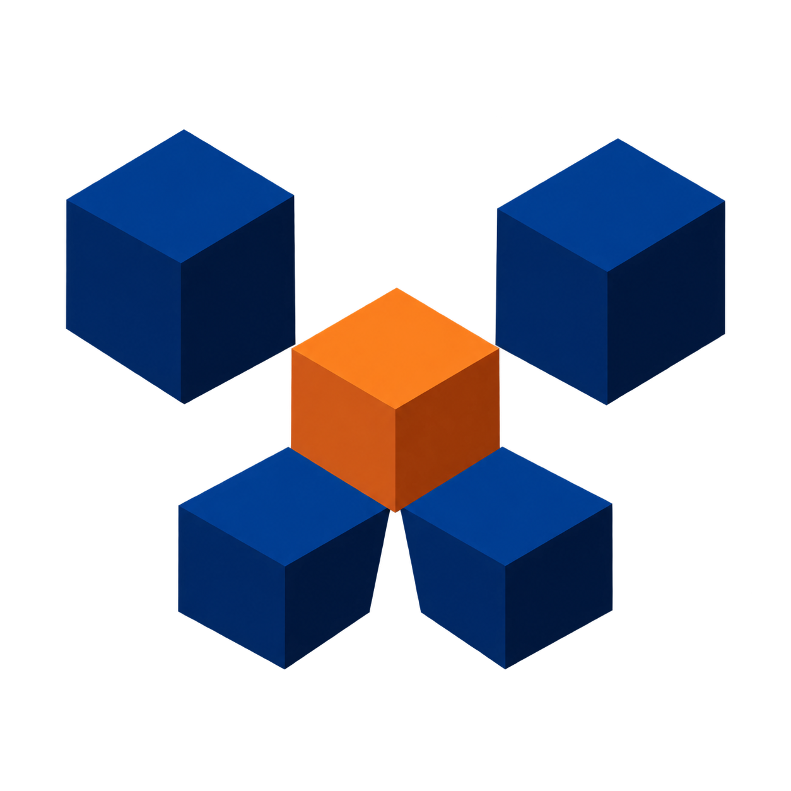
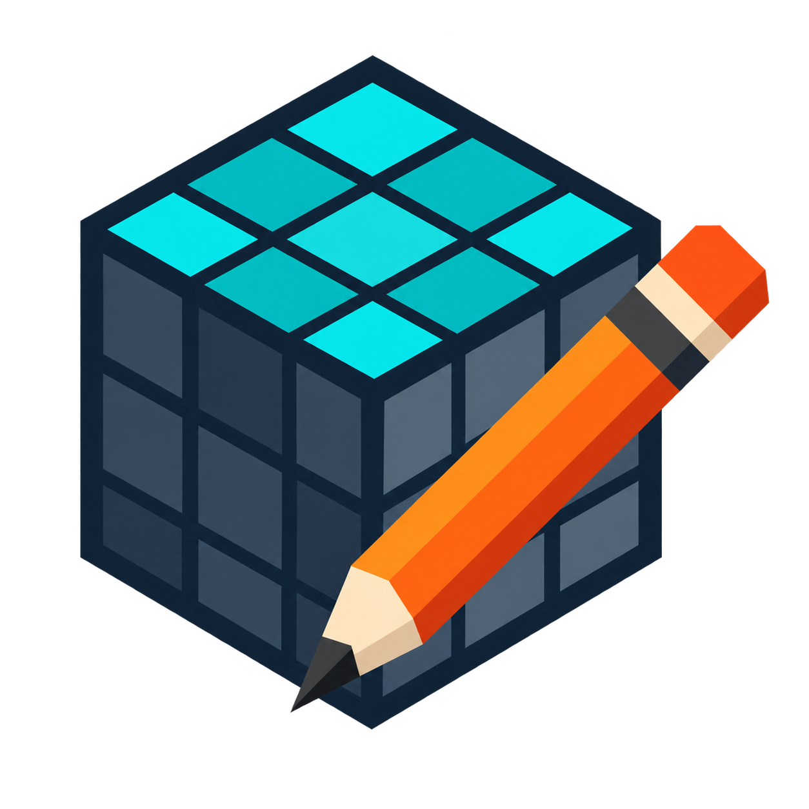

# Logo system and past options

The two marks below are the chosen VoxelWright logo system. The other ideas are kept farther down for reference.

Each chosen mark has a clear shape, no words, and a clear background. The small mark is made to stay readable on a Studio button.

## Current direction

Keep two related marks instead of forcing one image to do every job.

### Primary interlock mark

Use this on the Creator Store page, documentation, thumbnails, and other places where the mark has room. It has more personality and shows the block-building idea.

### Small toolbar stamp

Use this for the Studio toolbar and other small spaces. It has fewer shapes and a stronger outline at tiny sizes.

No more concept work is needed before production cleanup.

The second round follows the rules in the [logo design brief](logo-design-brief.md).

## Round two

### D3. Wrapped W cube

This has the most depth and personality. It can work in store pictures, but it has too much detail for a tiny toolbar button.

### B2. Voxel pencil cut

This joins the pencil and block instead of placing two stock icons side by side. The meaning is clear, but the pencil still feels familiar.

### B3. Voxel nib

This is the most original direction. It joins a W, a maker's nib, and a placed voxel into one shape.

### D4. Pixel-cut stamp

This is the clearest toolbar mark. It works with two shapes and should hold up in one color. It may need one more special proportion or cut to become memorable.

### Round-two result

The interlocking mark and D4 stamp were chosen as a two-mark system.

## Round one

## A. Block W

Five cubes make a loose W shape. This option feels most like a voxel tool.

Good:

- Simple blocks
- Easy to connect with the name VoxelWright
- Works without words

Watch for:

- The W may not be clear enough yet
- The blocks may look like a network icon when very small

## B. Maker pencil

A pencil crosses a block model. This option says “make and edit.”

Good:

- Easy to understand
- Friendly and hands-on
- Strong image for the store page

Watch for:

- Too much detail for a tiny Studio button
- May need a second, simpler toolbar version

## C. Import and merge

Small blocks flow into one larger block. This option shows importing and joining blocks.

Good:

- Shows what the plugin does
- Fits import and optimization work
- Clear motion

Watch for:

- The arrows may get hard to read when small
- Less useful for the voxel painting idea

## D. Maker stamp

A W-shaped cut makes one bold block. The orange square acts like one voxel.

Good:

- Strongest shape at small sizes
- Looks like a tool maker's stamp
- Easy to use on the toolbar and store page

Watch for:

- Says less about importing
- The top can look like a crown if the W is not refined

## Pick one

Choose **A**, **B**, **C**, or **D**. You can also ask to combine two ideas.

After the choice, make:

- A cleaned 1024×1024 master icon
- The 512×512 plugin image Roblox asks for
- Small 16, 32, 64, and 150 pixel test images
- Light and dark Studio previews
- A one-color version
- Store thumbnails that use the same mark and colors
