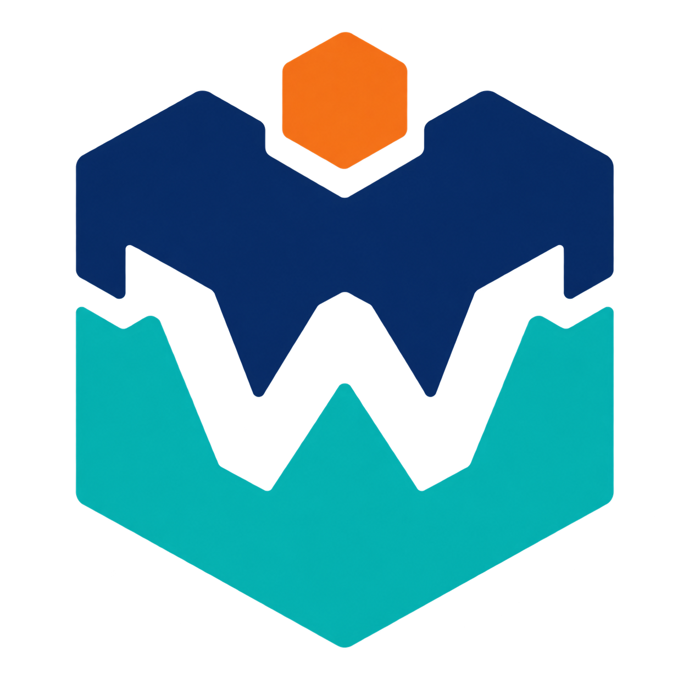

# Creator Store materials

This is the working plan for the VoxelWright store page.

## Roblox fields and media

Roblox asks for a 512×512 image when a plugin is first published. A Creator Store page can also show up to five images and one video for accounts that meet Roblox's verification rules.

Official pages:

- [Studio plugin publishing](https://create.roblox.com/docs/studio/plugins#upload-plugins)
- [Creator Store setup](https://create.roblox.com/docs/production/creator-store#distribute-and-sell-assets)

Check the upload form again before the final export. Roblox can change its rules.

## Store placement and search language

Publish VoxelWright as a **Plugin**, not as a model, texture, or asset pack. Roblox controls the finer Creator Store filters and may change them, so the name, first sentence, and screenshots need to do most of the discovery work.

Use these phrases in the title, description, and image labels where they fit naturally:

- Voxel modeling
- Building workflow
- Editable Roblox Parts
- MagicaVoxel import
- Java schematic and Bedrock structure import
- Minecraft world range import
- Part optimization

Aim at creators building worlds, cities, terrain, voxel art, and block-model games. Avoid describing it as an official Minecraft tool, a texture pack, a model pack, or a general-purpose mesh editor. Those labels either mislead users or put it beside the wrong kind of asset.

## Name

VoxelWright

## Logo system

- Use the **primary interlock mark** on the store page and large images.
- Use the **pixel-cut toolbar stamp** in Studio and other small spaces.
- Keep the same navy, teal, and orange colors across both marks.

### Primary mark

### Small Studio mark

The Studio plugin uses a small built-in version of the stamp until the uploaded Roblox image IDs are ready.

## Short line

Turn voxel files and Studio models into editable Parts.

## Draft description

VoxelWright helps you make block models in Roblox Studio.

Open a voxel file or select a model in Studio. Check the size and Part count before you build. Then make normal Roblox Parts that you can move, color, and edit.

VoxelWright can:

- Open MagicaVoxel `.vox` files.
- Open Java `.schem` files.
- Open Bedrock `.mcstructure` files.
- Open part of a Bedrock `.mcworld` file.
- Turn selected Studio models into voxels.
- Join matching blocks to make fewer Parts.
- Use original built-in textures or your own Roblox image assets.
- Make editable shapes for common stairs, slabs, fences, panes, signs, and plants.
- Optionally animate mapped water. This is Off by default; mapped water adds one runtime Script when enabled.
- Show warnings before it builds.
- Undo a finished build with Studio Undo.

Large models can take time. Minecraft mobs, chest items, commands, and redstone behavior are not built. Supported signs can keep their text. VoxelWright does not include Minecraft textures. You must have permission to use every file and image you import.

> **NOT AN OFFICIAL MINECRAFT PRODUCT. NOT APPROVED BY OR ASSOCIATED WITH MOJANG OR MICROSOFT.**

**Help, guides, bug reports, and feature requests:** <https://github.com/nathangeology/VoxelWright>

## Store image plan

Use short labels. Show the real plugin and real output. Do not use Mojang or Microsoft game art. Original art and clearly licensed art are okay when the required credit is included.

Put final PNGs in [`assets/store-media/screenshots`](../assets/store-media/screenshots/README.md). The numbered filenames there match this image order.

### Image 1: What it makes

Label: **Build your model in Minecraft → Bring it into Studio as editable parts**

Show the same original model in Minecraft and Studio. A short arrow should make the direction clear. If the Minecraft side uses licensed third-party textures, print the required credit on the image and keep it in this document set.

### Image 2: Check before building

Label: **See size and Part count first**

Show the source card, preview box, and output estimate.

### Image 3: Use fewer Parts

Label: **Join blocks when you need fewer Parts**

Show the same flat wall before and after blocks are joined. Add the two Part counts.

### Image 4: Original or custom textures

Label: **Built-in textures or your own**

Show the texture helper and an original textured model. Do not show Mojang or Microsoft texture art.

### Image 5: Three ways to work

Label: **Import • Voxelize • Optimize**

Show the three workflow buttons with one small result from each.

## Short video plan

Keep the video under one minute.

1. Pick a file.
2. Check its size and warnings.
3. Build editable Parts.
4. Turn a Studio model into voxels.
5. Join blocks to lower the Part count.
6. End on the VoxelWright name, logo, and help link.

Use captions. Do not use a voice-over unless the final Roblox rules allow it. Show only work that the release plugin can do.

## Before publishing

- Upload both logo marks to Roblox and check them at toolbar and store sizes.
- Capture the plugin in both light and dark Studio themes.
- Use original models and textures in every image.
- Check text at phone size.
- Add alt text for each image where Roblox allows it.
- Keep the public support link in the final description: <https://github.com/nathangeology/VoxelWright>
- Check every feature claim against the release build.
- Have a new user read the page without help.
